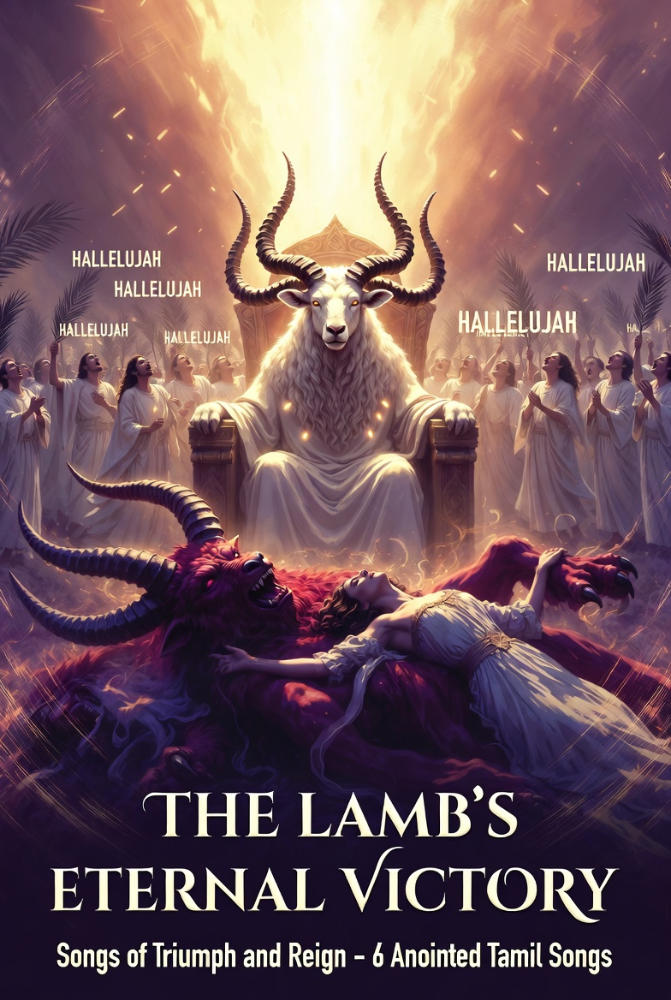

# Album 10: The Lamb's Eternal Victory – Songs of Triumph and Reign  
ஆட்டுக்குட்டியின் நித்திய வெற்றி – வெற்றி மற்றும் ஆட்சியின் பாடல்கள்

**Tamil Christian Worship Songs – Freshly Anointed**  

These songs are offered freely as worship to Jesus Christ and encouragement to the remnant.  
இந்த பாடல்கள் இயேசு கிறிஸ்துவுக்கு ஆராதனையாகவும், எஞ்சியோருக்கு ஊக்கமாகவும் இலவசமாக வழங்கப்படுகின்றன.  

Music generated with AI tools.  
Lyrics are original, written under divine inspiration.  
All glory to the Lord Jesus Christ.

6 triumphant worship songs proclaiming the Lamb’s eternal victory — from the cross to the throne, crushing every enemy, crowning His own with glory forever.

### Songs
1. பலியிடப்பட்ட ஆட்டுக்குட்டியே பாத்திரராயிருக்கிறீர் – Worthy Is the Lamb Who Was Slain  
2. உத்தம ஆசீர்வாதங்களோடு நீர் வருகிறீர் – With Perfect Blessings, You Come  
3. என் தேவனே என் தேவனே ஏன் என்னைக் கைவிட்டீர் – My God, My God, Why Have You Forsaken Me?  
4. என் ஜீவனுள்ள நாட்களெல்லாம் – All the Days of My Life  
5. ஆத்துமாவை மாயைக்கு ஒப்புக் கொடாதே – Yield Not Your Soul to Deceit  
6. உம்முடைய பாதைகளை எனக்கு நீர் போதித்தருளும் – Teach Me Your Paths, O Lord

### Full Lyrics Book
- [Download Album 10 Full Lyrics Book (Tamil & English)](./Album10_TheLambsEternalVictory_FullLyricsBook_TamilEnglish.pdf)

### Cover

### How to Use
- Read the PDF lyrics while playing instrumental tracks (available per song or in ZIP).  
- Worship in silent adoration — let the music carry your heart to the Lamb’s throne.

**All glory to the Lamb who was slain and now reigns forever!**  
Come, Lord Jesus — let the eternal hallelujah resound!

ஆமென் | அல்லேலூயா | Hallelujah forever!

Remnant, Tamil Intercessor  
KJC-DNN Organization  
January 2026
